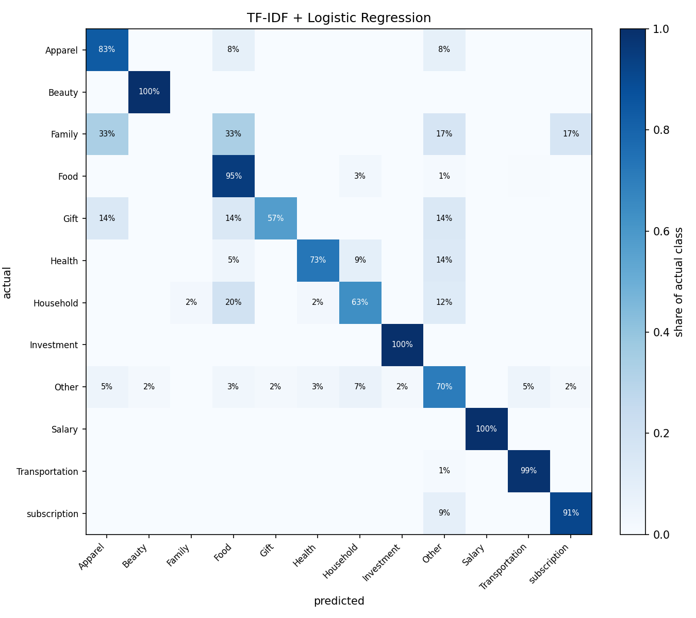

# expense-analyzer

[](https://github.com/Surge77/expense-analyzer/actions/workflows/ci.yml)
[](https://www.python.org/downloads/)
[](LICENSE)
[](#testing)
[](https://github.com/microsoft/pyright)

Turns a bank statement into findings about your spending — then asks whether
the hand-written rules doing the categorising are any good, and measures the
answer against a classifier.

```
raw export  ->  clean  ->  categorize  ->  aggregate  ->  charts + findings
 (messy)       (typed)     (labelled)      (summarised)     (answers)
                   |
                   +--> measured against 2,461 hand-labelled real transactions
```

## The result

Scored on real, human-labelled spending. Reproduce with
`python scripts/run_benchmark.py`.

**The headline number depends on a question most write-ups never ask: has the
model seen this description before?**

| split | notes seen in training | accuracy | macro F1 |
| --- | ---: | ---: | ---: |
| `random` | 56.7% | 87.0% | 0.769 |
| **`grouped`** (never-seen text) | **0%** | **72.1%** | **0.460** |
| `temporal` (train past, test future) | 58.6% | 87.2% | 0.784 |

Someone tracking expenses writes "grocery" hundreds of times, so a random
split scatters identical strings across both halves. Splitting the test set by
whether its note also appears in training:

| test subset | n | accuracy |
| --- | ---: | ---: |
| note also appears in training | 275 | 96.4% |
| genuinely unseen text | 210 | 74.8% |

Both numbers are honest — they answer different questions. Publishing only the
first would not be.

### Every approach, on genuinely unseen text

| approach | accuracy | macro F1 |
| --- | ---: | ---: |
| majority class (always "Food") | 43.7% | 0.055 |
| bank rules, ported out of domain | 13.4% | 0.029 |
| in-domain keyword rules | 56.9% | **0.502** |
| TF-IDF + logistic regression | **72.1%** | 0.460 |
| **hybrid — rules, then model** | **73.9%** | **0.567** |

**Hand-written rules beat the model on macro F1 when the text is genuinely
new.** The model wins on accuracy because accuracy is dominated by the large
classes it handles well; the rules win on breadth, because a keyword like
`doctor` keeps working on text nobody has ever seen while the model needs
vocabulary it recognises. Combining them beats both.

So the recommendation inverts depending on the situation — **rules-then-model
for novel descriptions, the model alone for your own recurring spending** —
and that is a measurement rather than a preference.

The ported bank rules scoring 13.4% is a third, separate finding: they match
merchant names (`UPI-SWIGGY-swiggy@icici-512334`) and the benchmark holds
private shorthand (*fruits and vegetables*, *Shengdane pav kg*), so 93.2% goes
unmatched. That measures **domain transfer**, not rule quality — which is
exactly why the in-domain rules exist as a fair baseline.

### It can also decline to answer

| threshold | coverage | accuracy when answered |
| --- | ---: | ---: |
| 0.0 | 100% | 87.0% |
| 0.3 | 82.1% | **94.2%** |
| 0.5 | 57.3% | 97.8% |

Abstaining on the least confident 18% raises accuracy from 87% to 94%. A
categorisation is a suggestion a human corrects, and a blank costs two seconds
where a confident wrong label quietly corrupts a total nobody re-checks.

Full write-up, per-class scores and confusion matrices: **[docs/results.md](docs/results.md)**.



## Quickstart

```bash
git clone https://github.com/Surge77/expense-analyzer.git
cd expense-analyzer
python -m venv .venv && source .venv/bin/activate   # Windows: .\.venv\Scripts\Activate.ps1
pip install -e ".[dev]"

python scripts/make_sample.py     # writes data/sample_statement.csv
python -m expense_analyzer        # prints every number, saves 4 charts
```

No accounts, no API keys, no network. The sample is generated locally.

```bash
python -m expense_analyzer --list-sources   # what data is available
python -m expense_analyzer --evaluate       # rules vs classifier, scored
python -m expense_analyzer --source household
python -m expense_analyzer --source bank --account 1196428
python -m expense_analyzer --statement data/my_statement.csv   # your own

# categorise with the classifier instead of the rules
python -m expense_analyzer --source household --categorizer hybrid
```

## Data

Three sources, three different jobs. The two public datasets download on
first use and are **never committed** — they carry their own licences, and a
repository is the wrong place to redistribute someone else's data. No Kaggle
credentials are needed; they are public.

| source | rows | job |
| --- | ---: | --- |
| `sample` | 180 | Instant demo. Generated locally, offline, safe to commit. |
| `household` | 2,461 | **Labelled benchmark.** The only source with ground-truth categories. |
| `bank` | 116,201 | **Parser stress test.** Real, messy, 10 accounts, 5 years. |
| your statement | — | The actual use case. Gitignored. |

### Your data stays local

`data/` is gitignored except the generated sample. A real statement carries
your account number, running balance and complete transaction history —
pushing it to a public repo puts it in git history permanently, and deleting
the file later does not remove it.

## What the real data broke

180 synthetic rows cannot exercise what a real export does to a parser. Every
item here was found by running against the 116,201-row bank dataset, and each
one is now pinned by a test.

- **Dates arrive already typed**, as `2017-06-29 00:00:00`, matching none of
  the expected formats. The entire file depends on the fallback parser.
- **Account numbers carry a stray quote** — `409000611074'` — an artefact of
  Excel forcing the value to stay a string.
- **Narrations are truncated mid-word.** The single most common row reads
  `FDRL/INTERNAL FUND TRANSFE`. A rule matching `...transfer` matched nothing;
  the rule now matches the stem.
- **Ten unrelated accounts share one file.** `savings_rate` refuses to run
  across them rather than summing ten strangers' incomes into a plausible,
  meaningless number.
- **A fifth of the labelled notes are empty** — 521 of 2,461. Nothing can
  classify them from text, so they are excluded and declared, not counted as
  failures.

## Layout

```
src/expense_analyzer/
├── data/
│   ├── schemas.py    Column names per source. Two amount shapes exist.
│   └── loaders.py    Download and read. No cleaning happens here.
├── clean.py          Stage 1. Rupee strings, day-first dates, footer rows.
├── categorize.py     Stage 2. Keyword rules, coverage reporting.
├── analyze.py        Stage 3. Aggregations only, no plotting.
├── plots.py          Stage 4. Four PNGs.
├── benchmark.py      The labelled data and three ways to split it.
├── baselines.py      Majority, rules, in-domain rules, hybrid.
├── evaluate.py       Accuracy, macro F1, confusion matrices.
├── model.py          TF-IDF + logistic regression.
└── cli.py            One command for all of it.
```

Each stage depends only on the one before it. `analyze` never plots, `plots`
never aggregates — which is why the aggregations are testable at all.

## The three problems this solves

**1. The numbers are text.** Banks print `1,347.00`, so the column arrives as
a string. `parse_amount` strips separators and treats blanks as zero.

**2. The dates are ambiguous.** `05/07/26` is 5 July in India and 7 May to
pandas' default parser. Getting this wrong produces wrong monthly totals and
**no error message**. Pinned by a test.

**3. The merchant is not the category.** `UPI-SWIGGY-swiggy@icici-512334` has
to become `Food`. That mapping is domain knowledge that exists nowhere in the
data, so it is hand-written — and it is a judgment call. Is Amazon `Shopping`
or `Groceries`? Decide, then defend the decision.

## The loop that is the project

```bash
python -m expense_analyzer
```

Read the "Rule coverage" block, then the unmatched narrations under it. Add
keywords to `CATEGORY_RULES` in `src/expense_analyzer/categorize.py`. Re-run.
Repeat until uncategorised is under ~5% **by value**.

The sample ships with roughly 8% unmatched on purpose — raw UPI phone numbers,
payment-gateway codes (`IN*RAZ*` is Razorpay, the processor, not the shop) and
bare NEFT references. Real statements look exactly like this.

Coverage is reported by row count **and** by rupees, because 5% of rows can
easily be 40% of the money.

## Testing

```bash
pytest                  # 158 unit tests, offline, ~15s
pytest -m integration   # 18 tests against the real datasets, ~3m
ruff check . && pyright # lint and types
```

Coverage is 94% and gated at 90% in CI. Warnings are errors — a
DeprecationWarning is how a silent behaviour change announces itself one
release before it breaks something.

## Known limits

- **No time of day.** Statements carry a date, not a clock time. Day-of-week
  is derivable; "spending after 9pm" is not.
- **Cash is invisible.** An ATM withdrawal shows as one lump. Where that cash
  went is unknowable from this data.
- **The model is one household.** 1,940 rows, one person's labelling
  conventions. Nothing here shows it generalises to anyone else, and it is
  trained on human notes rather than bank narrations — so it should not be
  expected to work on a raw statement. `--categorizer model` warns when
  pointed outside its domain.
- **Probabilities are uncalibrated.** A confidence of 0.8 does not mean
  "right 80% of the time"; the threshold is a dial tuned on the curve above.
- **`Family` is never predicted.** 23 examples with no distinctive vocabulary.
  Some classes simply are not learnable at this scale.
- **Rules are brittle by design.** A merchant renaming itself breaks a rule
  silently.

## Documentation

| Document | Contents |
| --- | --- |
| [docs/results.md](docs/results.md) | Full scores, per-class, error analysis, what did not work |
| [docs/architecture.md](docs/architecture.md) | Why the stages are separate and how data flows |
| [docs/glossary.md](docs/glossary.md) | TF-IDF, macro F1, stratified split — plain English |
| [docs/data-dictionary.md](docs/data-dictionary.md) | Every column, every source |
| [docs/decisions/](docs/decisions/) | Why rules first, why not a neural network |
| [MODEL_CARD.md](MODEL_CARD.md) | Intended use, metrics, limitations |
| [CONTRIBUTING.md](CONTRIBUTING.md) | Setup, workflow, what a good PR looks like |

## Notebooks

Both are committed with their outputs, so they read on GitHub without being run.

| Notebook | Contents |
| --- | --- |
| [01_explore.ipynb](notebooks/01_explore.ipynb) | The pipeline end to end on the sample: clean, categorise, aggregate, chart |
| [02_rules_vs_model.ipynb](notebooks/02_rules_vs_model.ipynb) | The measurement — baselines, the classifier, cross-validation, and where it goes wrong |

## Contributing

Contributions are welcome, particularly new `CATEGORY_RULES` keywords and
support for other banks' export formats. Start with
[CONTRIBUTING.md](CONTRIBUTING.md) and the
[good first issues](https://github.com/Surge77/expense-analyzer/labels/good%20first%20issue).

## Licence

[MIT](LICENSE).

The two public datasets are **not** redistributed here and remain under their
own terms on Kaggle:
[daily-transactions](https://www.kaggle.com/datasets/prasad22/daily-transactions-dataset)
and [bank-transaction-data](https://www.kaggle.com/datasets/apoorvwatsky/bank-transaction-data).
